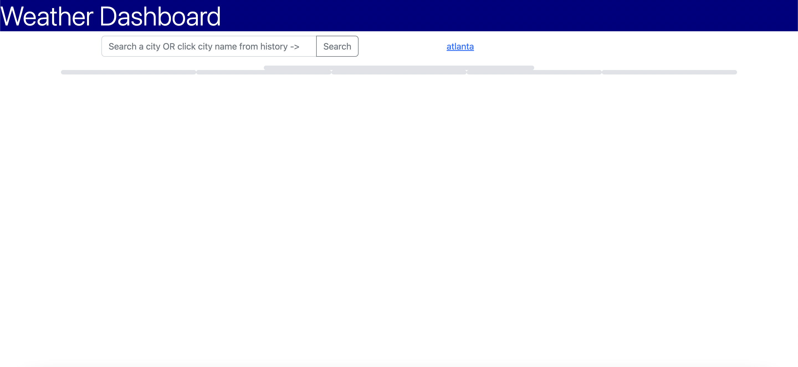
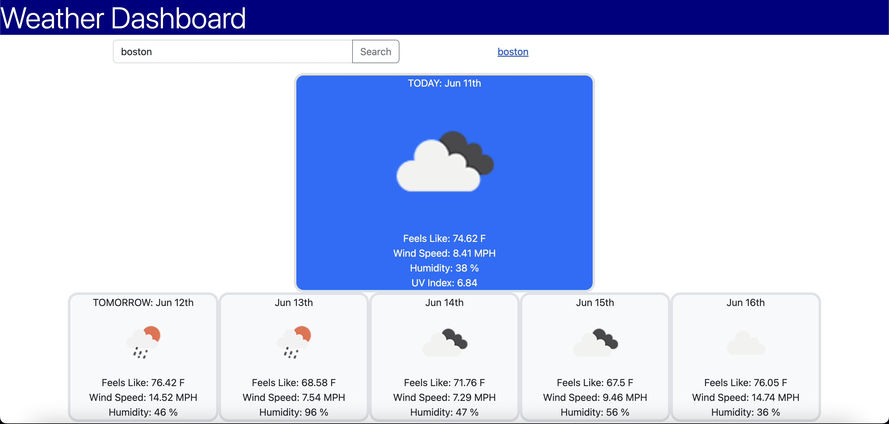
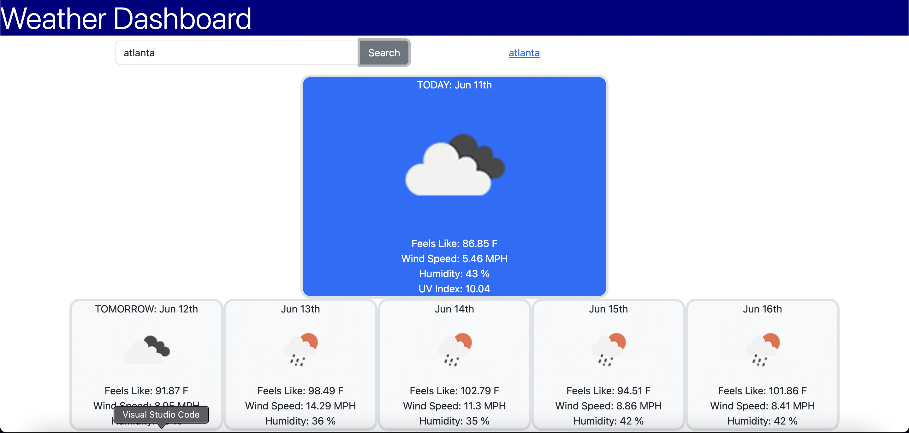

DEV INFO
---
Developer Name: Adam Martin

Title: WeatherApp

Due Date: 6/12/2022

LINKS
---
GIT REPO: https://github.com/AmartinVT/WeatherApp

GIT PAGE: https://amartinvt.github.io/WeatherApp/

API Documentation: https://openweathermap.org/current#one 

ABOUT
---
This web application allows the user to search a city in a free-text entry field. After clicking the search button, the search value will store in local storage. These saved values will be displayed in a list of the most recent searches. Clicking any of those saved searches will then search that value again.

The most recent searched city will display the weather data for the next 5 days.

This data will come from the "OpenWeatherAPI".

Moment.JS is used for time controls.

SCREENSHOTS
---

